# scientific_diary_2019-2020

## Articles
_____________

### Graph Networks

* [SEMI-SUPERVISED CLASSIFICATION WITH GRAPH CONVOLUTIONAL NETWORKS (ICLR 2017)](https://openreview.net/pdf?id=SJU4ayYgl)

Authors propose new type of convolution layers which also consider information extracted from graph through normalized Laplacian of that graph. Convolutions are calculated as follows: </img> </img>  </img>
where A - is adjacency matrix, H_l - is output of layer l and W is a matrix of convolution parameters. The main disadvantage of that method is that every convolution step is is applied to every graph node i.e. it is applied to the whole training dataset. **Thomas suggests**: "A good way to address the memory issue is to use some form of mini-batching, as e.g. in GraphSAGE: https://arxiv.org/abs/1706.02216" 

* [Multi-Label Image Recognition with Graph Convolutional Networks (CVPR 2019)](https://arxiv.org/abs/1904.03582#)  

Authors proposed GCN-like architecture for mapping labels from multilabeling task with per-label-classifiers. There are no memory issues since there are only order of hundreds of labels in tasks. Authors studied effects of different embedding representations for labels (there is almost no effect although more powerful embeddings could lead to better performance.). Authors also studied the effect of different adjacency matrix initializations: 
* Binary -- we count conditional probabilities P(L_i|L_j) for each pair of labels and then start procedure of binarization on this probabilities by comparing each node with some threshold (hyperparameter)
* Re-weighted -- aforementioned initializtion lead to problem reffered as oversmoothing -- that is, the node features may be over-smoothed such that nodes from different
clusters (e.g., kitchen related vs. living room related) may
become indistinguishable. To alleviate this problem, authors
propose the following re-weighted scheme: </img>

The proposed architecture: </img>

### 10.11.19
* [Actional-Structural Graph Convolutional Networks for Skeleton-based Action Recognition (CVPR 2019)](https://arxiv.org/pdf/1904.12659.pdf) 

The authors attempt to capture richer dependencies among joints by constructing generalized skeleton graphs.

The authors infer the actional links (A-links) to capture the latent dependencies between any joints. An A-link inference module (AIM) with an encoder-decoder structure is proposed. They also extend the skeleton graphs to represent higher order relationships as the structural links (S-links). Based on the generalized graphs with the A-links and S-links, they propose an actional-structural graph convolution to capture spatial features. 

Paper propose the actional-structural graph convolution network (AS-GCN), which stacks multiple of actional-structural graph convolutions and temporal convolutions. As a backbone network, AS-GCN adapts various tasks: action recognition as the main task and future pose prediction as the side one. The feature responses present that the authors could capture more global joint information than ST-GCN, which only uses the skeleton graph to model the local relations.

The AS-GCN achieves large improvement compared with the previous methods. Moreover, AS-GCN also shows promising results for future pose prediction.

### Neural Decision Trees

* [Deep Neural Decision Forests (ICCV 2015)](https://www.cv-foundation.org/openaccess/content_iccv_2015/papers/Kontschieder_Deep_Neural_Decision_ICCV_2015_paper.pdf)

The authors propose to use differentiable routing functions in each node. This way decision forest achieves end-to-end learning so input also could be updated and new representations could be achieved.

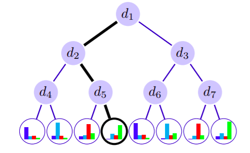</img>

For each tree the algorithm optimizes this functional:
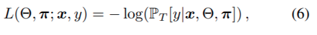</img>
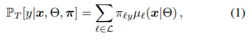</img>
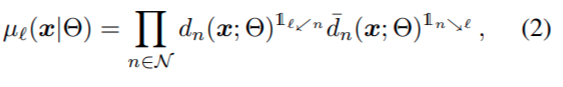</img>
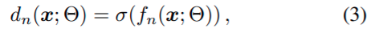</img>
Update rules look like this:
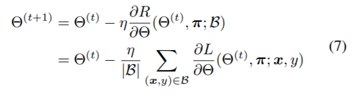</img>
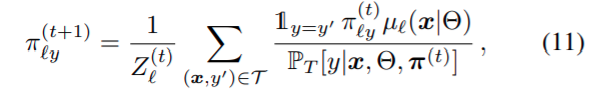</img>

And the algorithm, in general, is as follows:
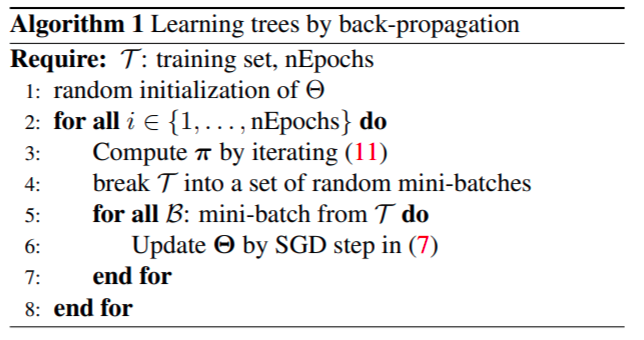</img>

* [Multi-Layered Gradient Boosting Decision Trees (NeurIPS 2018)](https://papers.nips.cc/paper/7614-multi-layered-gradient-boosting-decision-trees.pdf)

The authors suggest a multilayer architecture where each layer is represented as an gradient boosting. The main idea is to improve gradient boostings which are SOTa for tabular data tasks with idea of deep architectures. Instead of making trees differentiable authors suggest to learn inverse functions for each layer which would match output for this layer and it's input.

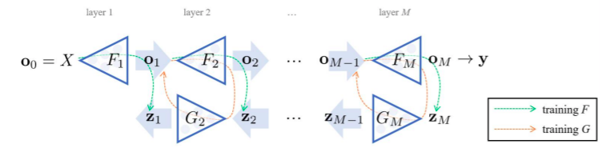</img>
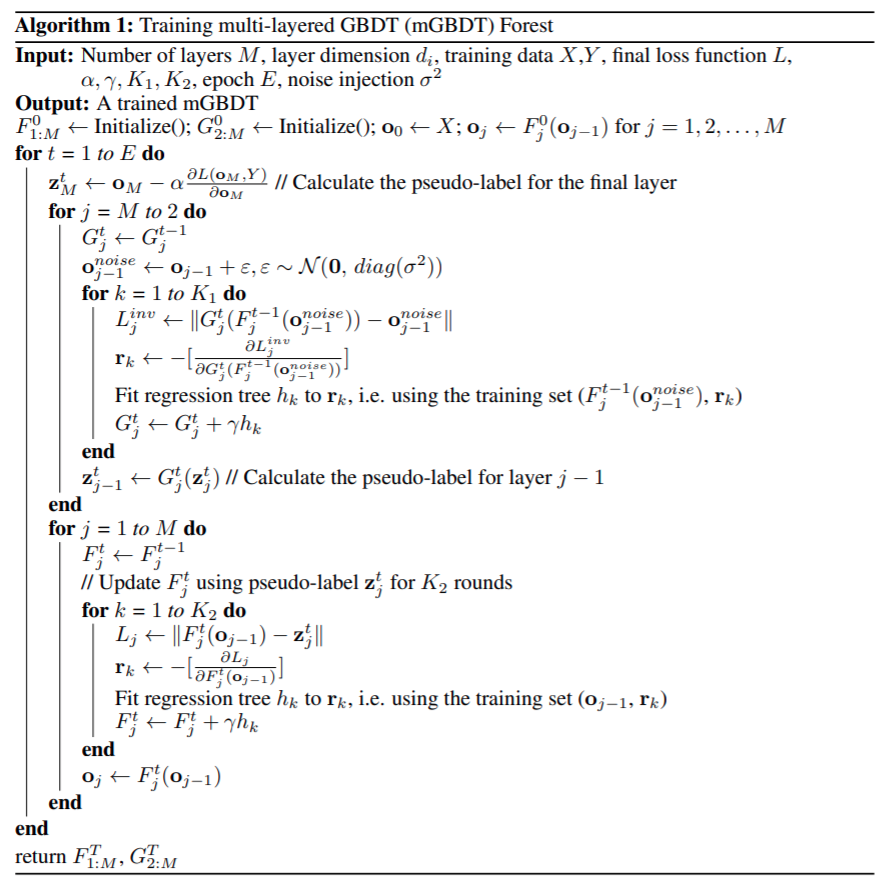</img>

As the result algorithm allows to retrieve nice representations of tabular data
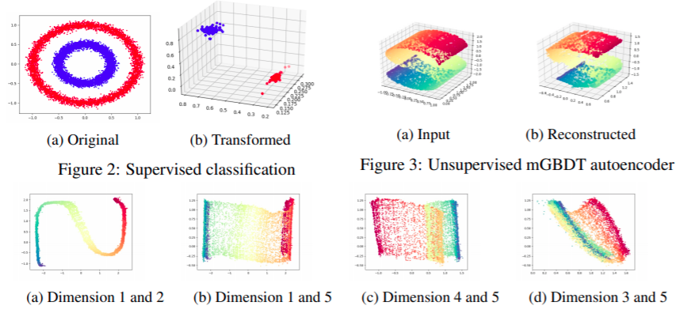</img>

[Implementation](https://github.com/kingfengji/mGBDT)

* [NEURAL OBLIVIOUS DECISION ENSEMBLES
FOR DEEP LEARNING ON TABULAR DATA (Yandex Research Team 2019)](https://arxiv.org/pdf/1909.06312.pdf)

[OpenReview ICLR2020](https://openreview.net/forum?id=r1eiu2VtwH)

[Implementation1](https://github.com/Qwicen/node), [Implementation2](https://github.com/anonICLR2020/node)

* [Deep Neural Decision Trees](https://arxiv.org/pdf/1806.06988.pdf)  

[Implementation](https://github.com/wOOL/DNDT)