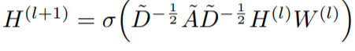
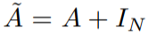
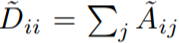
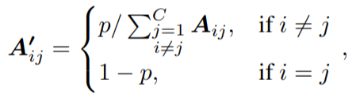
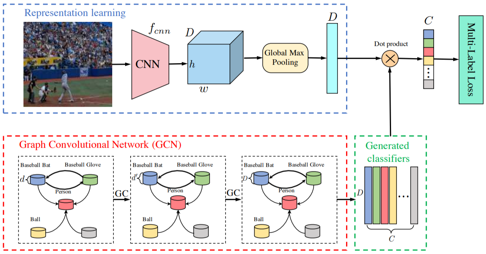

# scientific_diary_2019-2020

## Articles
_____________
* [SEMI-SUPERVISED CLASSIFICATION WITH GRAPH CONVOLUTIONAL NETWORKS (ICLR 2017)](https://openreview.net/pdf?id=SJU4ayYgl)

Authors propose new type of convolution layers which also consider information extracted from graph through normalized Laplacian of that graph. Convolutions are calculated as follows:  

</img>  

  

   

where A - is adjacency matrix, H_l - is output of layer l and W is a matrix of convolution parameters. The main disadvantage of that method is that every convolution step is is applied to every graph node i.e. it is applied to the whole training dataset. **Thomas suggests**: "A good way to address the memory issue is to use some form of mini-batching, as e.g. in GraphSAGE: https://arxiv.org/abs/1706.02216" 

* [Multi-Label Image Recognition with Graph Convolutional Networks (CVPR 2019)](https://arxiv.org/abs/1904.03582#)  

Authors proposed GCN-like architecture for mapping labels from multilabeling task with per-label-classifiers. There are no memory issues since there are only order of hundreds of labels in tasks. Authors studied effects of different embedding representations for labels (there is almost no effect although more powerful embeddings could lead to better performance.). Authors also studied the effect of different adjacency matrix initializations: 
* Binary -- we count conditional probabilities P(L_i|L_j) for each pair of labels and then start procedure of binarization on this probabilities by comparing each node with some threshold (hyperparameter)
* Re-weighted -- aforementioned initializtion lead to problem reffered as oversmoothing -- that is, the node features may be over-smoothed such that nodes from different
clusters (e.g., kitchen related vs. living room related) may
become indistinguishable. To alleviate this problem, authors
propose the following re-weighted scheme:  

The proposed architecture:  

